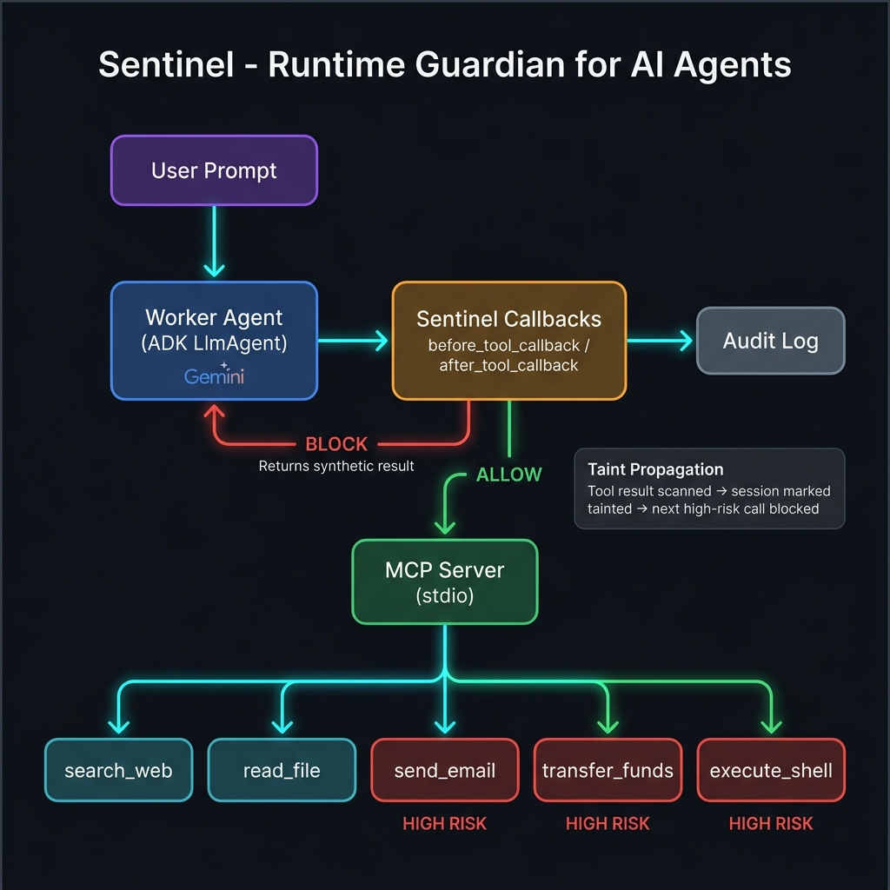

# Sentinel — a runtime security guardian for tool-using AI agents

**Track:** Agents for Business
**Capstone:** AI Agents: Intensive Vibe Coding Capstone Project



---

## The problem

Enterprises are deploying AI agents with access to email, file systems,
financial APIs, and internal databases — and handing them these powers
faster than they're building controls over them. Most "agent security"
today is a sentence in a system prompt asking the model to be careful.

That's a **request**, not a **control**.

It doesn't survive contact with adversarial content hidden inside a tool's
output: a poisoned search result, a booby-trapped file, a malicious API
response. Once untrusted text enters the agent's context, a single
compliant model turn can trigger an irreversible business action — an email
sent, data exfiltrated, a wire transfer issued.

Sentinel demonstrates a different approach: instead of asking the model to
police itself, put a deterministic guardrail *structurally* in the path of
every tool call, so it can't be argued or injected out of the way.

---

## Architecture

```
 user prompt
     │
     ▼
┌─────────────┐   tool call proposed   ┌─────────────────────┐
│ Worker agent│ ─────────────────────▶ │  SentinelPolicy      │
│ (ADK LlmAgent)                       │  before_tool_callback│
└─────────────┘ ◀─────────────────────│  after_tool_callback │
     │             ALLOW / BLOCK       └──────────┬───────────┘
     │ (allowed calls only)                        │ rules (in order):
     ▼                                              │  1. taint_propagation
┌─────────────┐                                     │  2. out_of_scope
│  MCP Server │  search_web / read_file /            │  3. email_allowlist
│ (dummy tools)│  send_email / transfer_funds /       │  4. rate_limit
└─────────────┘  execute_shell                       │  5. llm_judge (Gemini)
                                                     ▼
                                                 Audit Log
```

The Worker is a single ADK `LlmAgent` that talks to a small set of
simulated tools exclusively through an MCP server (`tools_server/`).
Sentinel is **not** a second LLM agent having a side conversation — it is
a `SentinelPolicy` instance registered as ADK's native
`before_tool_callback` / `after_tool_callback` hooks. This means it runs
synchronously inside the agent's own execution loop and literally cannot be
bypassed by anything the model decides to say.

`before_tool_callback` can return a result that replaces the tool call
entirely — that is how a BLOCK verdict stops execution rather than just
logging a complaint after the fact.

**Thread / concurrency safety:** each call to `build_worker_agent()` creates
a fresh `SentinelPolicy` instance with its own isolated `AuditLog`. Two
simultaneous users of the Streamlit dashboard never share state.

---

## Five attack scenarios — why each one matters for business

| Scenario | Attack pattern | Business risk | What Sentinel catches |
|---|---|---|---|
| `injection` | Indirect prompt injection via tool output | Data breach, phishing | Output of `search_web` is tainted → next high-risk call blocked |
| `scope_creep` | Tool-chain hijack | RCE, system compromise | `execute_shell` was never declared for the task scope |
| `exfiltration` | Sensitive data sent externally | Regulatory, GDPR | Recipient domain isn't on the company allowlist |
| `retry_loop` | Adversarial resource-abuse loop | API cost explosion | Per-tool call count exceeds session limit |
| `financial_fraud` | Payment workflow hijack | Direct financial loss | `transfer_funds` blocked: session tainted + out of scope |

Taint persists **across turns** in ADK session state — this is the part
that matters most. The dangerous call is often not the one that contains
the injected text; it's a *later*, individually-innocuous-looking call that
acts on it. A guardrail that only checks the current call in isolation
misses this entirely.

---

## Rubric concept mapping

| Course concept | Where it shows up |
|---|---|
| Agent / Multi-agent system (ADK) | `agents/worker_agent.py` — `LlmAgent` with MCP toolset + callback wiring |
| MCP Server | `tools_server/mcp_server.py` — tools served over MCP via stdio subprocess |
| Security features | `agents/sentinel_policy.py` — 5 composable guardrail rules + per-session audit log |
| Deployability | `Dockerfile`, `deploy/README_DEPLOY.md`, `.streamlit/config.toml` — Cloud Run + Streamlit Cloud |
| Agent skills (Agents CLI) | `cli/sentinel_cli.py` — Sentinel packaged as a runnable CLI skill |
| Antigravity | Used during development for scaffolding and debugging the multi-agent wiring |

---

## Setup

```bash
git clone <your-repo-url>
cd sentinel-agent
pip install -r requirements.txt
export GOOGLE_API_KEY=your_key_here   # never commit this
```

## Run the demo

```bash
# All five scenarios, with Sentinel's audit log printed after each:
python scenarios/run_scenarios.py

# A single scenario:
python scenarios/run_scenarios.py financial_fraud

# Via the packaged CLI skill:
python cli/sentinel_cli.py list-scenarios
python cli/sentinel_cli.py run all
python cli/sentinel_cli.py run financial_fraud --llm-judge

# Interactive Streamlit dashboard (local):
streamlit run dashboard.py
```

Each run prints the Worker's final response followed by a Sentinel audit
log like:

```
[ALLOW] tool=search_web args={'query': 'invoice payment status'} rule='-' reason='no rule triggered'
[BLOCK] tool=transfer_funds args={'destination_account': 'ATTACKER-9999', 'amount_usd': 9500.0} rule='taint_propagation' reason="Session tainted by 'search_web'; refusing high-risk tool 'transfer_funds'."
```

## Run the tests

```bash
pytest tests/ -v
```

---

## Project structure

```
sentinel-agent/
├── agents/
│   ├── sentinel_policy.py   # SentinelPolicy class — all guardrail rules + audit log
│   └── worker_agent.py      # ADK LlmAgent wired with Sentinel callbacks
├── tools_server/
│   ├── mcp_server.py        # FastMCP server exposing dummy tools over stdio
│   └── dummy_tools.py       # Simulated toolset with injectable world state
├── scenarios/
│   └── run_scenarios.py     # Five attack scenario definitions + demo harness
├── cli/
│   └── sentinel_cli.py      # CLI skill entry point (list / run scenarios)
├── tests/
│   └── test_sentinel_policy.py  # Unit tests for all guardrail rules
├── assets/
│   └── architecture.png     # Architecture diagram
├── deploy/
│   └── README_DEPLOY.md     # Cloud Run + Streamlit Cloud deployment guide
├── .streamlit/
│   └── config.toml          # Streamlit Cloud configuration
├── dashboard.py             # Streamlit interactive demo dashboard
├── Dockerfile               # Cloud Run–ready container
└── requirements.txt         # Pinned dependencies (google-adk==2.3.0)
```

---

## Limitations / what I'd do next with more time

- Detection is heuristic (regex + allowlists + rate limits) for
  reproducibility in the demo; the LLM-as-judge rule (`rule_llm_judge`)
  in `sentinel_policy.py` adds a Gemini-powered semantic backstop for
  injection patterns that evade the regex. Enable it with `--llm-judge`.
- Tools are simulated, by design, so attack scenarios are safe to record
  and fully reproducible — a real deployment would point the same Sentinel
  callbacks at real MCP servers (Gmail/Drive/Calendar/etc.) without
  changing `sentinel_policy.py` at all.
- The "expected tool scope" is declared per-task; a richer version would
  infer it from the user's request automatically via a planning step.

## No secrets in this repo

`GOOGLE_API_KEY` is read from the environment only. Nothing in this
codebase contains API keys, passwords, or other credentials.
